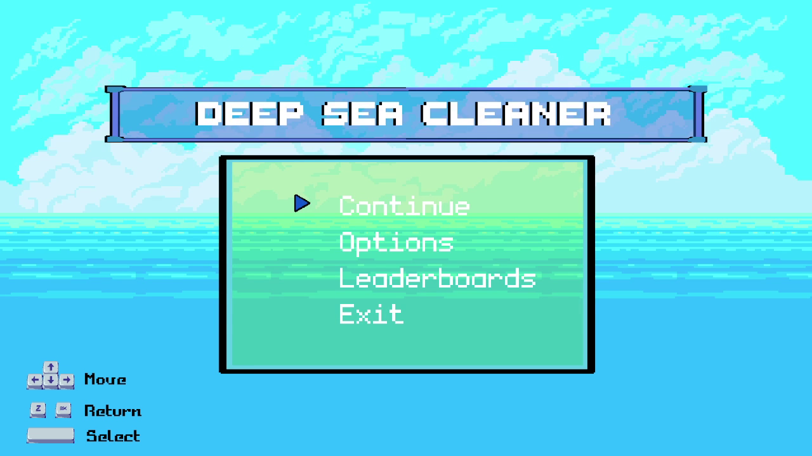
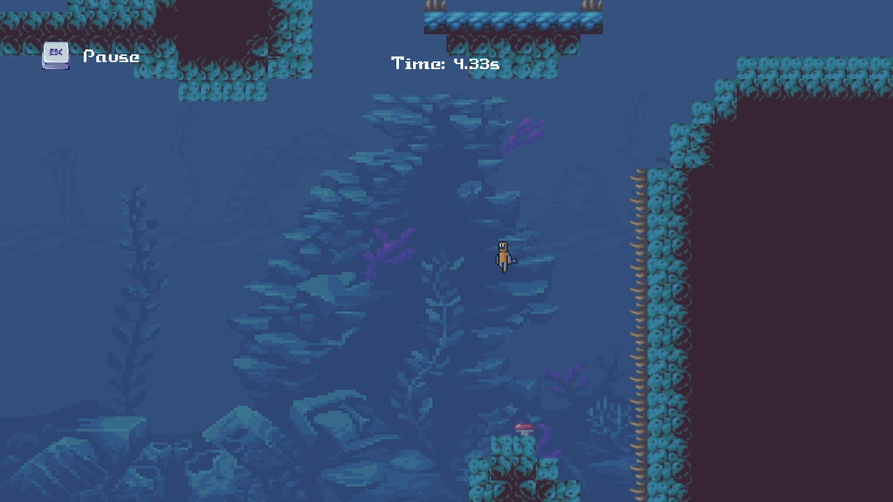
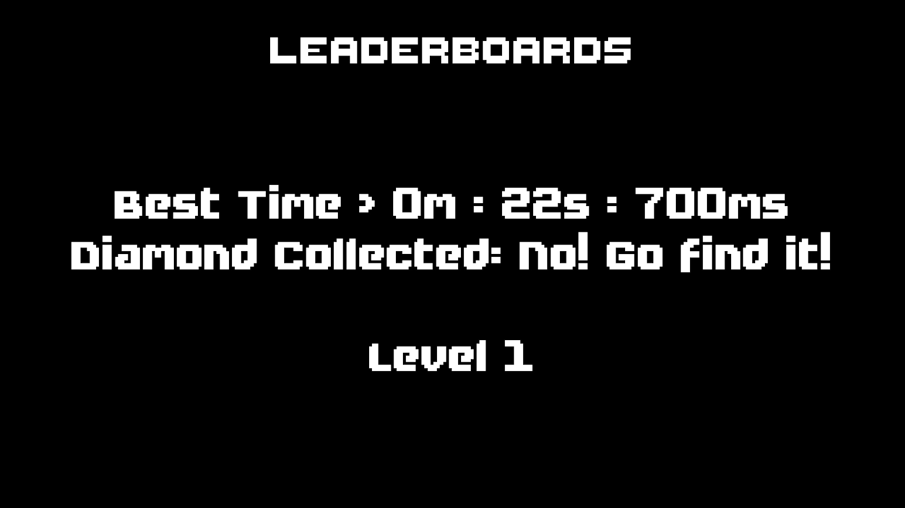
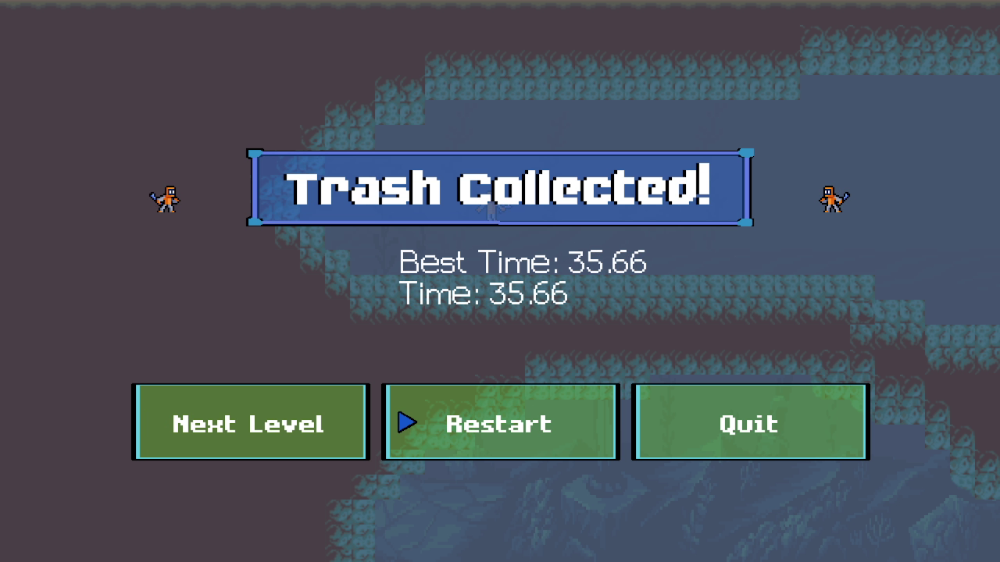

# Deep Sea Cleaner
This is a game project created using Python and Pygame for a local Game Jam in university. It was made in 2021, tested on 17th April 2024 on a new system and still works.

https://github.com/user-attachments/assets/eaf99421-6660-4f2a-8805-36287dab7fd0

**System tested on:**  
OS: Arch Linux, Linux LTS 6.6.27, KDS Plasma 6, Wayland Compositor  
Processor: Intel® Core™ i5-1035G1 CPU  
Memory: 8Gb of RAM  
Graphics: Built-in  

**Software Versions:**  
Python 3.11.8  
pygame 2.5.2  

> [!warning]
> <b>THIS GAME IS NOT IN DEVELOPMENT ANYMORE. IF THERE ARE ISSUES RUNNING THE CODE, REVERT TO AN OLDER VERSION OF DEPENDENCIES SHOULD RESOLVE IT.</b>

---

 
 

## Installation

1. Download or git clone the repository.  
`git clone https://github.com/JoeMingT/deep-sea-cleaner`

2. Then, install pygame for your python interpretor or virtual environment.  
`pip install pygame`

3. Finally, run the `main.py` file using your python interpreter  
`python main.py`

## Controls

| Key           | Action               |
| ------------- | -------------------- |
| Arrow Keys    | Move                 |
| Spacebar      | Jump or Confirm      |
| Z             | Activate Scuba Gear  |
| Esc           | Exit, Quit or Cancel |

## Screenshots

## Acknowledgements
Most of these assets that I have used are taken from online. Credit foes to the original source. Unfortunately as this is an old project and back then I'm bad with crediting things, as such I have lost all links to credits. But I believe if you search hard enough you may be able to find all of the sources.
